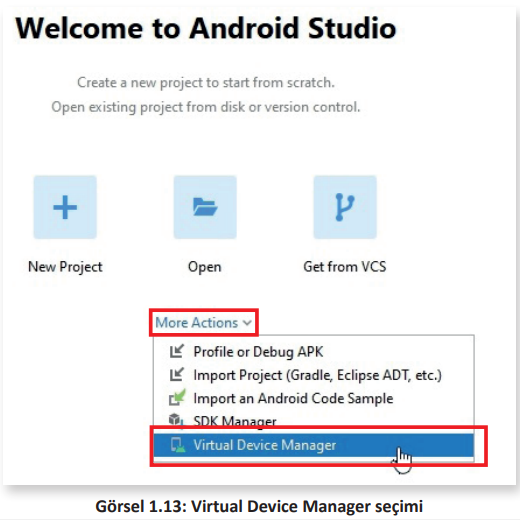
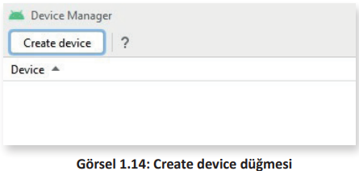
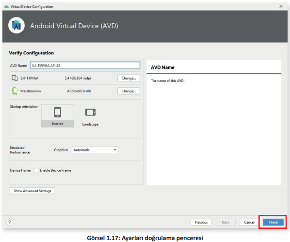
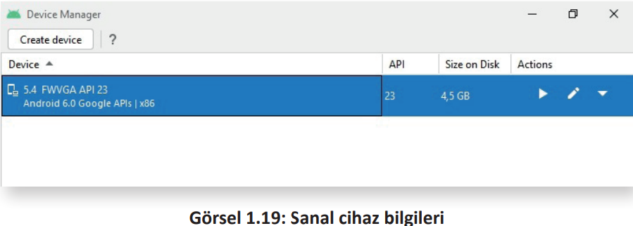
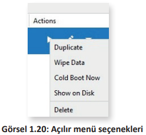
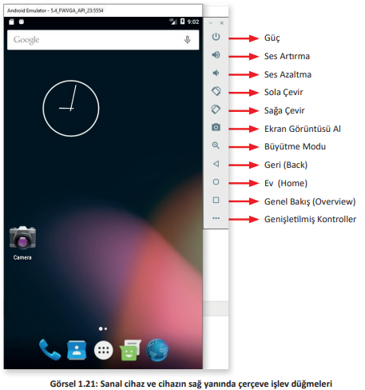
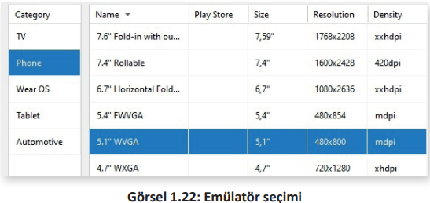

## 1.2. EMÜLATÖR KURULUMU

Farklı işletim sistemine ait programları yerel işletim sisteminde çalıştırmak için aracı yazılımlara
ihtiyaç duyulur. Bu aracı yazılımlara emülatör ismi verilir. Android Studio içinde mobil işletim
sistemine uygun emülatör programı kurulabilir. Geliştirilen uygulamalar bu emülatörde test edilebilir.

Kurulumdan sonra Android Studio çalıştırıldığında karşılama ekranında **More Actions (Ek Eylemler)** listesindeki **Virtual Device Manager (Sanal Cihaz Yöneticisi)** seçeneği tıklanır (Görsel 1.13).

Açılan **Device Manager (Cihaz Yöneticisi)** penceresindeki **Create device (Cihaz oluştur)** düğmesine tıklanır (Görsel 1.14). 

**Select Hardware (Donanım Seç)** penceresi açılır. Bu pencerede **Category (Kategori)** kısmında TV,
Phone (Cep telefonu), Wear OS (Giyilebilir cihazlar), Tablet ve Automotive (Otomotiv tabletleri)
yer alır. Uygulamanın çalıştırılacağı cihaz hangi kategorideyse o kategori seçilerek uygun ekran
büyüklüğü ve çözünürlük belirlenir. Görsel 1.15’te 480 piksel genişliğinde, 854 piksel uzunluğunda ve 5.4 inch ekran büyüklüğüne sahip bir cep telefonu cihazı seçilmiştir. İhtiyaç duyulması hâlinde **New Hardware Profile (Yeni Donanım Profili)** düğmesiyle boyut ve çözünürlüğünü kullanıcının ayarlayabileceği bir cihaz oluşturulabilir. **Import Hardware Profiles (Donanım Profili İçe Aktar)** düğmesiyle daha önceden dosyaya kaydedilmiş bir donanım profili yüklenebilir. Clone
Device (Cihazı Kopyala) düğmesi kullanılarak da belirli bir cihazın özellikleri kopyalanır. Kopyalanan cihazın birkaç özelliğinde değişiklik yapılabilir. Next düğmesi tıklanarak bir sonraki pencereye
geçilir.

**Select a system image (Sistem imajı seçimi)** penceresinde emülatör cihazına bir işletim sistemi seçilir. Pencerenin üstünde **Recommended (Tavsiye edilen)**, **x86 Images (x86 İşlemciler için imajlar)** ve **Other Images (Diğer imajlar)** olmak üzere üç adet sekme yer alır.

- **Recommended**: Bu sekme seçiliyken en hızlı çalışacak işletim sistemi imajı kullanıcıya görüntülenir.
- **x86 Images**: x86 işlemcilerde çalışacak işletim sistemi imajları görüntülenir. 32 bitlik işlemciler için listede x86 olarak belirtilmişken 64 bitlik işlemciler için x86_64 olarak işletim
sistemleri belirtilmiştir.
- **Other Images**: Diğer işlemcilerde çalışacak işletim sistemi imajları görüntülenir

**UYARI**: Her Android işletim sistemi sürümü için tek bir API düzeyi belirlenmiştir. Application Programming Interface (Uygulama Programlama Arayüzü) kelimelerinin baş harfleriyle API isimlendirilmesi
yapılır. API, yazılımların kendi aralarında iletişim kurmasını sağlayan bir yapıdır. API düzeyi düştükçe
yazılan uygulamanın çalışacağı cihaz sayısı artar ancak uygulamada kullanılacak özellikler azalır. API
düzeyi yükseldikçe uygulamada kullanılacak özellikler artar ancak kapsadığı cihaz sayısı azalır.

Recommended sekmesindeki Android işletim sistemlerinin isimlerinin hemen yanında Download
düğmesi yer alır. Bu düğmeyle o işletim sisteminin imajı indirilir ve işletim sistemi seçime hazır
hâle getirilir. Görsel 1.16 penceresinde Marshmallow (Android 6.0) işletim sistemi indirilmiş ve
seçime hazır hâle getirilmiştir. Bu sürüm seçilir ve Next düğmesine tıklanır.

Kurulumun son penceresinde oluşturulan ayarların doğruluğu kontrol edilebilir ve bu pencereden ayarlar değiştirilebilir (Görsel 1.17).

- **AVD Name (AVD İsmi)**: Ayarlanan cihazın ismi bu kutuya yeni değer girilerek değiştirilebilir.
- **5.4” FWVGA 5.4 480x854 mdpi**: Bu yazının sağ tarafında yer alan **Change… (Değiştir)** düğmesi ile ekran boyutları farklı bir cihaz seçilebilir.
- **Marshmallow Android 6.0 x86**: Bu yazının sağ tarafında yer alan **Change…** düğmesi ile
seçilen işletim sistemi değiştirilebilir.

- **Startup Orientation (Başlangıç Yönlendirmesi)**: Bu bölümde yar alan iki farklı **Portrait (Portre) ve Landscape (Manzara)** simgelerinden biri seçilerek cihazın dikey ve yatay kullanılacağı belirlenebilir. Dikey kullanım için Portrait simgesi seçilir, yatay kullanım içinse
Landscape simgesi seçilir.
- **Emulated Performance (Emülasyon Performansı)**: Bu yazının sağ tarafındaki **Graphics: (Grafikler)** açılır kutusunda üç seçenek yer alır. **Automatic (Otomatik), Hardware (Donanım)** ve **Software (Yazılım)** isimli seçeneklerden bilgisayarın grafik kartı kullanılacaksa
emülasyon için Hardware seçilir. Grafik kartıyla problemler yaşanırsa ve grafik kartı yerine
yazılım kullanılacaksa emülasyon için Software seçilir. Emülasyonun duruma göre otomatik
olması istenirse Automatic seçilebilir.
- **Device Frame (Cihaz Çerçevesi)**: Bu onay kutusu işaretlenerek sanal cihazın kenarında çeşitli işlev düğmeleri kullanılabilir hâle getirilir. Bu düğmeler istenmezse bu onay kutusu
işaretlenmez.
- **Show Advanced Settings (Gelişmiş Ayarları Göster)**: Sanal cihazla ilgili ayrıntılı ayarlar yapılması gerektiğinde bu düğme tıklanır. Bu düğme tıklandıktan sonra cihaz ön ve arka kamera ayarları, ana bellek miktarı, yardımcı depolama bellek miktarı, SD kart bellek miktarı,
cihazın işlemci sayısı gibi ayrıntılı ayarların belirlenebileceği kutular pencerede belirir. 

Finish düğmesine tıklandıktan sonra pencerenin ortasında **Creating Android Virtual Device (Android Sanal Cihaz Oluşturuluyor)** ifadesi görüntülenir (Görsel 1.18).

Sanal cihaz oluşturulduktan sonra pencerenin en üstünde Görsel 1.19’daki bilgiler ve simgeler görünür.

Bu bilgilerde sanal cihazın ismi, sanal cihazda yüklü olan işletim sistemi, API düzeyi, yardımcı depolama biriminde kapladığı alan ve Actions (Eylemler) simgeleri yer alır. Bu simgeler şunlardır:

**Launch this AVD in the emulator (Bu Android Sanal Cihazı emülatörde çalıştır)**: Bu simge
tıklanarak sanal cihaz çalıştırılır.

**Edit this AVD (Bu Android Sanal Cihazı düzenle)**: Sanal cihazla ilgili değişiklik yapılması gerekirse bu simge tıklanır.

Bu simge tıklandığında açılır bir menü ile karşılaşılır (Görsel 1.20). Bu menüdeki seçenekler
şunlardır: 

- **Duplicate (Çoğaltma)**: Sanal cihazın özelliklerine sahip
ikinci bir kopya oluşturmak için kullanılır.
- **Wipe Data (Verileri Sil)**: Sanal cihazı fabrika ayarlarına
döndürmek için kullanılır. Sonradan düzenlenen verileri
siler ve cihazı ilk açılış durumuna getirir.
- **Cold Boot Now (Soğuk Önyükleme Şimdi)**: Sanal cihazın herhangi bir kaydedilmiş durumdan değil, en baştan
açılmasını sağlar.
- **Show on Disk (Disk Üzerinde Göster)**: Sanal cihazın dosyalarını bulunduğu klasörde gösterir.
- **Delete (Sil)**: Sanal cihazın silinmesini sağlar.

Emülatörde sanal cihazı başlatmak için  simgesine tıklanır. Her şey doğru ayarlandıysa Android
işletim sistemi yüklü bir cep telefonu cihaz penceresi ekranda belirir (Görsel 1.21).

**1. UYGULAMA**: İşlem adımlarına göre mobil uygulama geliştirme ortamında 5.1 inch
büyüklüğünde Android 6.0 işletim sistemi kullanan bir emülatör kurulumunu yapınız.

**1. Adım**: Mobil uygulama geliştirme programını çalıştırınız.\
**2. Adım**: Karşılama ekranında More Actions seçeneğine tıklayınız.\
**3. Adım**: Açılan listeden Virtual Device Manager seçeneğine tıklayınız.\
**4. Adım**: Yeni gelen pencerede Create device düğmesine tıklayınız.\
**5. Adım**: Select Hardware penceresinde Category kısmından Phone ve 5.1”WVGA seçiniz (Görsel\
1.22).

**6. Adım**: Next düğmesini tıklayınız.\
**7. Adım**: Select a system image penceresinde Marshmallow seçiniz.\
**8. Adım**: Next düğmesini tıklayınız.\
**9. Adım**: Verify Configuration penceresinde Finish düğmesine tıklayınız.\

**SIRA SİZDE**: 

>Mobil uygulama geliştirme ortamında 6.7 inch büyüklüğünde Android 6.0
işletim sistemi kullanan bir emülatör kurulumunu yapınız.

**DEĞERLENDİRME**: 

>Çalışmanız aşağıda yer alan kontrol listesi kullanılarak değerlendirilecektir. Çalışmanızı yaparken değerlendirme ölçütlerini dikkate alınız.

**KONTROL LİSTESİ**

|DEĞERLENDİRME ÖLÇÜLERİ|EVET|HAYIR|
|---|---|---|
|1. Mobil uygulama geliştirme ortamını çalıştırdı.|
|2. Karşılama ekranında More Actions seçeneğine tıkladı.|
|3. Açılan listeden Virtual Device Manager seçeneğine tıkladı.|
|4. Yeni gelen pencerede Create device düğmesine tıkladı.|
|5. Select Hardware penceresinde Category kısmından Phone ve 6.7” Horizantal seçti.|
|6. Next düğmesine tıkladı.|
|7. Select a system image penceresinde Marshmallow seçti.|
|8. Next düğmesine tıkladı.|
|9. Verify Configuration penceresinde Finish düğmesine tıkladı.|