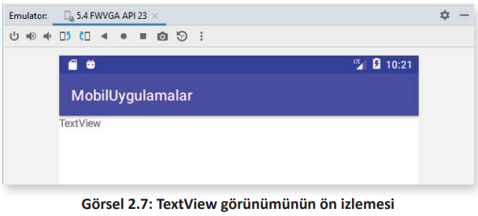
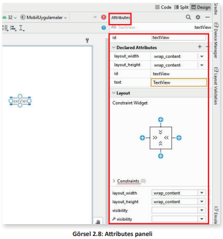

## 2.4. GÖRÜNÜM YERLEŞTİRME YÖNTEMLERİ

Görünüm, mobil uygulamalarda kullanıcı arabiriminin temel yapı taşıdır ve ekranda içerik gösteren
dikdörtgendir. Görünüm; bir resim, bir metin parçası, bir düğme veya bir mobil uygulamanın görüntüleyebileceği herhangi bir şey olabilir. Tüm görünümler dikdörtgen şeklindedir ve bu dikdörtgenler
ekranda görünmez. Bu dikdörtgenin boyutu, sayılar girilerek veya daha önceden tanımlanmış bazı
değerler kullanılarak ayarlanabilir. Önceden tanımlanmış bu değerler şunlardır:

* **wrap_content**: İçeriğin görüntülenmesi için
gereken kadar alanı kaplayacağı anlamına
gelir.

* **match_parent**: Cihazın ekranında bulunan
tüm alanı kaplayacağı anlamına gelir (Görsel
2.5).


Genişlik ve yükseklik niteliklerine wrap_content ve
match_parent önceden tanımlı değerler girilebileceği gibi sayılar da girilebilir ancak bu sayıların yanında birim olması gerekir. Bu birimler şunlardır:

- **px (Pixels)**: Girilen değerin ekranda gerçek piksel olarak karşılığıdır.
- **in (Inches)**: Girilen değerin ekranda gerçek inç karşılığıdır.
- **mm (Millimeters)**: Girilen değerin ekranda gerçek milimetre karşılığıdır.
- **pt (Points)**: Girilen değer 1/72 inç oranındadır.
- **dp (Densityindependent Pixels)**: Ekranın fiziksel yoğunluğuna dayanan soyut bir birimdir.
Bu birimler 160 dpi ekrana oranlanır. Bu nedenle 1 dp, 160 dpi ekranda 1 piksele karşılık
gelir.
- **sp (Scaleable-independent Pixels)**: Bu birim, dp birimine benzer ancak kullanıcının yazı
tipi boyutu tercihine göre ölçeklendirilir.

Bir görünümün genişliği, XML kod olarak içeriği gösterecek kadar olsun istenirse **android:layout_width=“wrap_content”** şeklinde yazılır veya görünümün genişliği 200 piksel olsun istenirse **android:layout_width=“200px”** şeklinde yazılır.

**ÖRNEK**
- **android:layout_width=“20in”** XML kodu, görünüm genişliğinin 20 inç olmasını sağlar.
- **android:layout_width=“40mm”** XML kodu, görünüm genişliğinin 40 milimetre olmasını
sağlar.

Görünümler, mobil uygulama ekranına yerleştirilirken üç farklı yöntem kullanılır. Bu yöntemler
şunlardır:

1. XML kodlarını kullanarak görünüm yerleştirmek

2. Palette panelini kullanarak görünüm yerleştirmek

3. Java kodlarını kullanarak görünüm yerleştirmek

### 2.4.1. Görünüm Yerleştirmek İçin XML Kullanımı
Mobil uygulamada herhangi bir görünümü ekrana yerleştirmek için XML kodları kullanılır. XML
kodları kullanılarak yapılan bu işlem, **Declarative Approach (Bildirimsel Yaklaşım)** olarak adlandırılır. Genellikle XML kodları **activity_main.xml** dosyasının içine yazılır.

XML kodları kullanılarak yapılan görünüm ayarları kod yapısı şu şekildedir:

```XML
<Görünümİsmi
	 Nitelik1=Değer1
	 Nitelik2=Değer2
	 Nitelik3=Değer3
    .
    .
	 NitelikN=DeğerN
/>
```

XML kodlanırken dikkat edilecek özellikler şunlardır:

- Her zaman küçüktür işareti “<” ile başlar ve ardından görünüm ismi yazılır.
- Görünüm, ekranda nasıl görünecekse bir nitelik ve değer kod olarak yazılır. Her görünümün kendine has nitelikleri vardır.
- “/>” işaretleri kullanılarak görünüm ayarları kapatılır.

**ÖRNEK**

Ekranda “Programlamayı seviyorum.” metnini gösteren bir TextView görünümünün XML’de yazımı şu şekildedir:

```xml
<TextView
    android:id=”@+id/MU_TextView_id”
    android:layout_width=”wrap_content”
    android:layout_height=”wrap_content”
    android:text=”Programlamayı seviyorum.”
 />
```

Her görünüm, **android:layout_width (görünümün genişliği)** ve **android:layout_height (görünümün yüksekliği)** gibi en az iki niteliğe değer verilirse uygulama ekranında görüntülenir. Görünümün boyutları, bu niteliklere değer atanarak ayarlanır. Bu iki nitelik kullanılarak mobil uygulamadaki tüm görünüm çeşitlerinin boyutları ayarlanabilir.

### 2.4.2. Görünüm Yerleştirmek İçin Palette Kullanımı
Bir mobil uygulamada herhangi bir görünümü ekrana yerleştirmek için mobil uygulama geliştirme ortamında bulunan Palette panelindeki bileşenlerden biri sürükle bırak yardımıyla Design
(Tasarım) bölümüne bırakılır. Projedeki activity_main.xml dosyası seçiliyken görünümlerden Design düğmesi tıklanır ve çalışma alanında Palette panelindeki görünümlerden istenen herhangi
biri sürükle bırak yöntemiyle tasarım alanına bırakılır (Görsel 2.6).


Görünümlerden ekranda metin göstermek için kullanılan TextView, tasarım ekranına yerleştirilerek proje ön izleme simgesine tıklanır veya Shift+F10 klavye tuşlarına basılarak mobil uygulama
çalıştırılır. Mobil uygulamada ConstraintLayout yerleşimi kullanıldığı ve TextView görünümünün
nitelikleri ayarlanmadığı için TextView otomatik olarak ekranın sol üst bölümüne yerleşir (Görsel
2.7).



Tasarım ekranında seçili görünümün nitelikleri, mobil uygulama geliştirme ortamında **Attributes**
paneli kullanılarak değiştirilebilir. Bu paneldeki kutulara sayılar veya ön tanımlı değerler girilerek
görünümün nitelikleri değiştirilir (Görsel 2.8).



**1. UYGULAMA**: İşlem adımlarına göre mobil uygulama geliştirme ortamında tasarım
ekranına Palette panelini kullanarak Button görünümünü yerleştiriniz.

**1. Adım**: Mobil uygulama geliştirme programını çalıştırınız.\
**2. Adım**: Çalışma alanında activity_main.xml dosyasını seçiniz.\
**3. Adım**: Palette paneline ve Design ekranına geçmek için Code, Split ve Design sekmelerinden
Design sekmesini tıklayınız.\
**4. Adım**: Palette panelindeki Button görünümünü sürükle bırak yöntemiyle Design ekranına bırakınız.\
**5. Adım**: Shift+F10 klavye tuşlarına basarak uygulamanın ön izlemesini yapınız.

**SIRA SİZDE**: 

>Mobil uygulama geliştirme ortamında Palette panelinde yer alan CheckBox
görünümünü tasarım ekranına yerleştiriniz. 

**DEĞERLENDİRME**: 

>Çalışmanız aşağıda yer alan kontrol listesi kullanılarak değerlendirilecektir. Çalışmanızı yaparken değerlendirme ölçütlerini dikkate alınız.

**KONTROL LİSTESİ**


|DEĞERLENDİRME ÖLÇÜLERİ|EVET|HAYIR|
|---|---|---|
|1. Mobil uygulama geliştirme ortamını çalıştırdı.|
|2. Çalışma alanında activity_main.xml dosyasını seçti.|
|3. Palette panelinde Buttons seçti.|
|4. Palette panelinde CheckBox görünümünü sürükle bırak yöntemiyle tasarım ekranına yerleştirdi.|
|5. Shift+F10 tuşlarına basarak uygulamanın ön izlemesini yaptı.|

**2. UYGULAMA**: İşlem adımlarına göre mobil uygulama geliştirme ortamında tasarım
ekranına yerleştirilmiş CheckBox görünümünün layout_width kutusuna 100 dp değerini Attributes panelini kurarak giriniz.

**1. Adım**: Tasarım ekranında yer alan CheckBox görünümünü seçiniz.

**2. Adım**: Çalışma alanında Attributes panelindeki layout_width kutusuna tıklayınız.

**3. Adım**: Klavyeden 100 dp değerini giriniz.

**4. Adım**: Shift+F10 klavye tuşlarına basarak uygulamanın ön izlemesini yapınız.

**UYARI**: ContraintLayout yerleşimindeyken constraint (kısıtlama) ayarları yapılmadığında ön izlemede görünüm sol üst köşede yer alır. 


**SIRA SİZDE**: 

>Mobil uygulama geliştirme ortamında CheckBox görünümünün Attributes
panelindeki text kutusuna Bilişim Teknolojileri yazarak ekranda görünecek
metni belirleyiniz.

**DEĞERLENDİRME**: 

>Çalışmanız aşağıda yer alan kontrol listesi kullanılarak değerlendirilecektir.
Çalışmanızı yaparken değerlendirme ölçütlerini dikkate alınız.

**KONTROL LİSTESİ**

|DEĞERLENDİRME ÖLÇÜLERİ|EVET|HAYIR|
|---|---|---|
|1. Tasarım ekranındaki CheckBox görünümünü seçti.|
|2. Attributes panelindeki text kutusuna tıkladı.|
|3. Klavyeden “Bilişim Teknolojileri” yazdı.|
|4. Shift+F10 tuşlarına basarak uygulamanın ön izlemesini yaptı.|

### 2.4.3. Görünüm Yerleştirmek İçin Java Kullanımı
Görünümler, Java kodları kullanılarak da tanımlanır veya oluşturulur. Java kodlarıyla yapılan bu işlem, **Programmatic Approach (Programatik Yaklaşım)** olarak adlandırılır. Genellikle Java kodları
MainActivity.java dosyası içine yazılır.

**ÖRNEK**

TextView görünümünün metni Java kodlarıyla değiştirilmek istenirse şu kodlar yazılır:

```java
TextView textView = (TextView) findViewById(R.id.textView);
textView.setText(“Bilişim Teknolojileri”);
```
